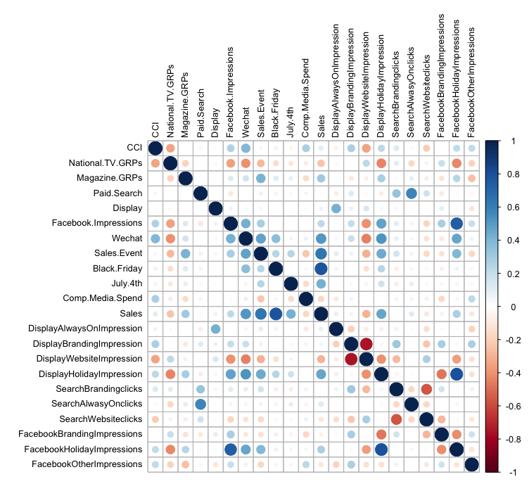

# Marketing Mix Modelling project
This is an end-to-end project on marketing mix modelling of a consumer product's marketing activities and environment activities between 2014 and 2018.   
 \
This project includes data ETL, model optimization, side diagonistic, business insight and budget optimization.  

## TLDR
* Collected, aggreagted, cleaned data using MySQL to manage ETL process.
* Created EDA data visualizaiton using Tableau.
* Performed multivariate regression models using R to evaluate marketing tactics impact.
* Built Tableau dashboards to visualize model results; Also including informative AVM, model contributions, media ROIs to deliver key business insights.
* Analyzed effectiveness and efficiency of media activities (e.g., TV GRPs, Paid Search Clicks, Facebook ads, Display Impressions, etc.).
* Provided actionable recommendation on budget optimization using Excel Solver.
* Created presentation deck to summarize model findings and presented result to marketing team.

## Table of Content
* [Goal](#goal)
* [Data Description](#data-description)
* [Data Preprocess](#data-preprocess)
* [Modelling](#modelling)
* [Visualization](#visualization)
* [Evaluation & Side Diagonistic](#evalutaion-&-side-diagnostic)
* [Budget Optimization](#budget-optimization)
* [Presentation](#presentation)

## Goal

## Data Description
Data [(link)]() is limited to header and 1 line of encoded value.
* Sales
    - MMM_Sales_Raw.csv
* Marketing activity
    - MMM_AdWordsSearch_2015.csv
    - MMM_AdWordsSearch_2017.csv
    - MMM_DCMDisplay_2015.csv
    - MMM_DCMDisplay_2017.csv
    - MMM_Event.csv
    - MMM_Facebook.csv
    - MMM_Offline_TV_Magazine.csv
    - MMM_Wechat.csv
* Competitor
    - MMM_Comp_Media_Spend.csv
* Environment (could include market specific) 
* Other
    - MMM_Date_Metadata.csv
    - MMM_DMA_HH.csv

## Data Preprocess
MySQL to aggregate all files together [(code)](MySQL/data_preprocess.sql).
* To make ETL more robust, I assume 2015-data is preloaded and 2017-data which has 6-month overlap is added later.
* I only selected 1-3 drivers for each channel to reduce model collinearity and simplicity of this project.
* Dependent variables (sales volume) and independent variables (drivers of growth) are aggregated on weekly level to reduce daily noise.
* Special event such as Black-Friday/Christmas/July-4th are later added in modelling stage.
* Other detail can be found in sql notes

## Pre-Modelling EDA & Data Transformation
* EDA visualization in R [(selected code)](). 
* Adding Lag, Decay to 6 selected marketing channels, apply Power curve [(R)]() [(Python)]().

Solarized dark             |  Solarized Ocean
:-------------------------:|:-------------------------:
This plot shows sales highly correlated to sales event | This plot shows the correlation between sales and all variables
   |  
* Details for Decay, Lag & Alpha in power curve.
    - Traditional media normally has higher lag.
    - Online media noramlly has high decay.

|             |    Decay    | Lag | Alpha |
|:-----------:|:-----------:|:---:|:-----:|
| National TV |     0.8     |  0  |  0.9  |
| National TV |     0.8     |  1  |  0.6  |
|   Magazine  |     0.7     |  1  |  0.6  |
|   Magazine  |     0.9     |  1  |  0.6  |
| Paid Search |     0.9     |  0  |   1   |
| Paid Search |     0.9     |  1  |  0.7  |
|   Display   |     0.8     |  0  |  0.8  |
|   Display   |      1      |  0  |   1   |
|   Facebook  |      1      |  0  |  0.8  |
|   Facebook  |      1      |  1  |   1   |
|    Wechat   |     0.8     |  0  |  0.9  |
|    Wechat   |     0.9     |  1  |   1   |

## Modelling & Visualization

## Evaluation & Side Diagonistic

## Budget optimization

## Presentation

